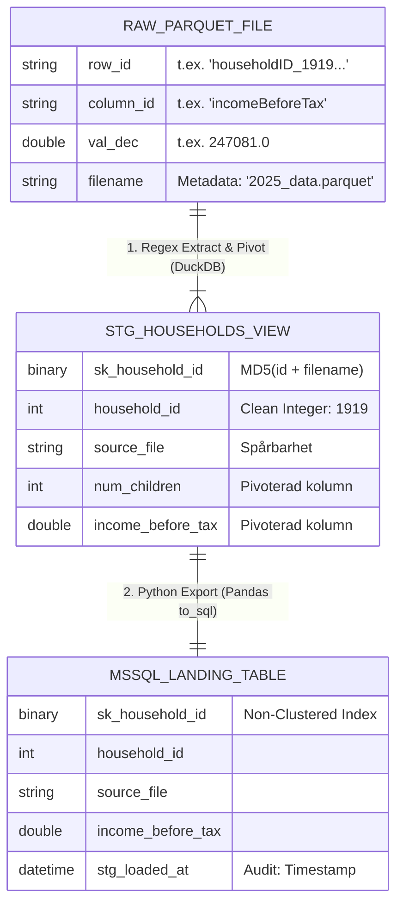

# Arkitekturbeskrivning: Hybrid-DWH (DuckDB ➡ SQL Server)

Denna lösning implementerar en **"Best of Both Worlds"**-strategi. Vi använder moderna dbt-mönster i DuckDB för logik och unikhet, men anpassar den fysiska lagringen för att respektera hur Microsoft SQL Server presterar bäst.

> This document has two parts:
> - **Part 1 (Swedish)** — the original v1 design: deterministic surrogate keys, SQL-Server-optimised physical storage, Kimball naming. Still in force for the households pipeline.
> - **Part 2 (English)** — the v2 medallion lakehouse design introduced with the SCB bulk-file pipeline: raw→bronze→silver, two bronze formats, DuckDB→SQL Server via `mssql` community extension, SCD2 via `dbt snapshot`.

---

## Part 1 — Hantering av Surrogate Keys (v1: households)

### 1. Hur det fungerar (Tekniskt flöde)

Lösningen består av två distinkta steg som separerar *logik* från *lagring*:

* **I Transformeringen (DuckDB/dbt):**
  Vi genererar en **deterministisk Surrogate Key (SK)** baserat på datats innehåll (`household_id` + `filename`).
  * Funktion: `MD5 Hash` → `UNHEX` → `BINARY(16)`.
  * Resultat: Ett unikt ID (t.ex. `0x4A1B...`) skapas redan *innan* datat når SQL Server. Samma indata ger alltid samma ID.

* **I Laddningen (Python/SQL Server):**
  Vi skriver datat till SQL Server som en **Heap** (utan fysisk sortering) och applicerar indexet i efterhand.
  * Tabellen skapas utan Clustered Index (för snabb skrivning).
  * Ett **Non-Clustered Index** skapas på vår `sk_household_id` (för snabb sökning).

### 2. Varför är detta bra för Utvecklare?

Detta mönster löser flera klassiska problem vid datalagerutveckling:

* **Idempotens & Testbarhet:** Eftersom nyckeln genereras baserat på datat (hash), får samma rad alltid samma ID oavsett hur många gånger vi kör laddningen. Vi behöver inte fråga SQL Server "vilket är nästa nummer?" för att veta ID:t. Det gör det enkelt att köra om laddningar utan att skapa dubbletter eller bryta relationer.
* **Enklare Joins:** Utvecklare behöver inte joina på 3-4 kolumner (`ON t1.id = t2.id AND t1.file = t2.file...`). De joinar bara på **en** kolumn: `ON t1.sk_household_id = t2.sk_household_id`.
* **Frikoppling:** Utvecklingsteamet kan bygga och testa hela logiken lokalt i DuckDB utan att vara beroende av en uppkopplad SQL Server-instans för att generera ID-nummer.

### 3. Mänsklig Läsbarhet vs. Maskinell Precision

Här har vi gjort en tydlig avvägning:

* **Maskinen:** Får `sk_household_id` (`BINARY 16`). Den är **inte** läsbar för människor (`0x9F86D08...`), men den är optimal för datorn att jämföra exakt.
* **Människan:** Vi behåller alltid "Business Keys" i klartext (`household_id`, `filename`, `year`).
* *Vinsten:* Vi blandar inte ihop *identitet* (Hashen) med *information* (Hushålls-ID). Om ett Hushålls-ID byter format i framtiden, går inte hela databasstrukturen sönder, eftersom vi lutar oss mot vår genererade nyckel.

### 4. SQL Server Prestanda (Det kritiska valet)

Detta är den viktigaste punkten. Vi undviker "MD5-fällan" som ofta sänker prestandan i SQL Server.

| Aspekt | Traditionell "Naiv" Lösning | Vår Optimerade Lösning |
| --- | --- | --- |
| **Datatyp** | `VARCHAR(32)` (Textsträng) | **`BINARY(16)` (Raw Bytes)** |
| **Storlek (Index)** | 32 bytes per rad. | **16 bytes per rad (50% mindre).** |
| **Index-typ** | Clustered Index på Hash (Dåligt) | **Non-Clustered Index på Heap (Bra)** |
| **Skriv-prestanda** | **Långsam.** Slumpmässiga hashar tvingar SQL Server att sortera om disken fysiskt vid varje insert ("Page Splits"). | **Blixtsnabb.** Nya rader läggs bara "sist i högen" (Heap) utan att flytta runt existerande data. |
| **Fragmentering** | **Hög.** Indexet trasas sönder snabbt. Kräver konstant underhåll. | **Låg/Ingen.** Eftersom vi inte tvingar fysisk sortering på en slumpmässig nyckel. |
| **Läs-prestanda** | Bra, men dras ner av fragmentering. | **Mycket bra.** Det icke-klustrade indexet pekar direkt på rätt rad vid uppslag. |

**Sammanfattning:** Genom att använda `BINARY(16)` och **Non-Clustered Index** får vi dbt:s flexibilitet utan att offra SQL Servers prestanda. Vi får snabbast möjliga inserts (Load) och snabba Lookups (Transform/Consume).

### 🏛️ Informationsmodell & Nyckelstandard

Vi tillämpar en strikt nyckelstrategi baserad på **Ralph Kimballs** metodik för Data Warehousing, anpassad för prestanda i **SQL Server**. Strategin separerar den *logiska identiteten* (som dbt och utvecklare använder) från den *fysiska lagringen* (som databasen använder).

| Typ (Kimball) | Kolumnnamn (Suffix) | Datatyp (SQL Server) | Syfte & Beskrivning |
| :--- | :--- | :--- | :--- |
| **Surrogate Key** | `_sk` | `BINARY(16)` | **Joins & Unikhet.**<br>En deterministisk hash (MD5) av *Business Key* + *Metadata*. Denna nyckel är **idempotent** (samma indata ger alltid samma ID) och används för att binda ihop tabeller i lagret.<br>*Exempel:* `household_sk` |
| **Business Key** | `_bk` | `INT` / `VARCHAR` | **Verksamhets-ID.**<br>Det ursprungliga ID:t från källsystemet. Detta ID används för spårbarhet och visas för slutanvändare i rapporter.<br>*Exempel:* `household_bk` |
| **Physical Key** | `_row_id` | `IDENTITY(1,1)` | **Lagring (Intern).**<br>SQL Servers interna räknare för att hantera fysisk sortering (Clustered Index) på disk. Denna nyckel är **inte** persistent vid omladdningar och ska **aldrig** användas som främmande nyckel (Foreign Key). |
| **Metadata** | `source_file` | `VARCHAR(255)` | **Kontext.**<br>Anger ursprunget för datat (t.ex. filnamn eller källsystem). Möjliggör att samma *Business Key* kan återkomma i olika filer (t.ex. årsvis) utan att skapa dubbletter. |

### Dataflöde (v1: EAV Parquet → Pivoted SQL Server)



---

## Part 2 — v2 Medallion Lakehouse (SCB bulk-file pipeline)

The SCB bulk-file pipeline introduces a medallion split with MinIO as the lake storage layer and SQL Server as the serving layer. Two bronze variants are built in parallel for comparison (Parquet vs DuckLake), and the DuckDB→SQL Server push uses the `mssql` community extension natively (replacing the `mssqlsqlalchemy` Python plugin used in v1).

### Data flow

```
                                ┌─────────────────────────────────┐
                                │ seedcsv/*.txt (local)           │
                                └─────────────────┬───────────────┘
                                                  │ create_minio_hive.py
                                                  ▼
                       ╔══════════════════════════════════════════╗
                       ║ RAW  (MinIO, hive-partitioned .txt)      ║
                       ║ s3://informat/seedcsv/                   ║
                       ║   year=YYYY/month=MM/day=DD/             ║
                       ║     scb_bulkfil_JE_<ts>_*.txt            ║
                       ╚════════════════════╤═════════════════════╝
                                            │ DuckDB httpfs + read_csv
                                            │ (latin-1, all_varchar,
                                            │  hive_partitioning=true)
                                            ▼
                       ┌──────────────────────────────────────────┐
                       │ stg_scb_bulkfil   (DuckDB view)          │
                       │   typed, lowercase, effective_date from  │
                       │   hive partition                         │
                       └──┬─────────────────────────────────┬─────┘
                          │                                 │
                          │ materialized='external'         │ materialized='ducklake'
                          │ (Parquet, hive-partitioned)     │ (custom Jinja materialization)
                          ▼                                 ▼
        ╔══════════════════════════════╗   ╔══════════════════════════════════════╗
        ║ BRONZE-PARQUET (MinIO)       ║   ║ BRONZE-DUCKLAKE (MinIO + SQLite cat) ║
        ║ s3://informat/bronze-parquet/║   ║ s3://informat/bronze-ducklake/       ║
        ║   scb_bulkfil/year=/month=/  ║   ║ catalog: fidemo/ducklake_catalog.db  ║
        ║     day=/part-*.parquet      ║   ║ lake.bronze.scb_bulkfil              ║
        ╚══════════════╤═══════════════╝   ╚═══════════════╤══════════════════════╝
                       │                                   │
                       │ DuckDB ATTACH mssql               │ DuckDB ATTACH mssql
                       │ (custom `mssql_native` mat)       │ (custom `mssql_native` mat)
                       ▼                                   ▼
        ╔══════════════════════════════════╗ ╔══════════════════════════════════════╗
        ║ SILVER LANDING (SQL Server)      ║ ║ SILVER LANDING (SQL Server)          ║
        ║ finance.scb_bulkfil_landing_     ║ ║ finance.scb_bulkfil_landing_         ║
        ║   from_parquet                   ║ ║   from_ducklake                      ║
        ╚══════════════╤═══════════════════╝ ╚═══════════════╤══════════════════════╝
                       │                                     │
                       │ dbt snapshot                        │ dbt snapshot
                       │ --target sqlserver                  │ --target sqlserver
                       │ strategy=check, unique_key=peorgnr  │ (sibling snapshot)
                       ▼                                     ▼
        ╔══════════════════════════════════╗ ╔══════════════════════════════════════╗
        ║ SILVER SCD2 (SQL Server)         ║ ║ SILVER SCD2 (SQL Server)             ║
        ║ finance.snap_scb_bulkfil_scd2    ║ ║ finance.snap_scb_bulkfil_scd2_       ║
        ║   dbt_valid_from/to,             ║ ║   from_ducklake                      ║
        ║   dbt_scd_id, dbt_updated_at     ║ ║                                      ║
        ╚══════════════════════════════════╝ ╚══════════════════════════════════════╝
```

### Layer responsibilities

| Layer | Storage | Format | Purpose | Update mode |
|---|---|---|---|---|
| **raw** | MinIO | tab-delimited `.txt` | Immutable archive of source deliveries. Never modified. | Append-only (new hive partitions per delivery) |
| **bronze-parquet** | MinIO | Hive-partitioned Parquet | Typed, normalized. Zero-cost read by any engine. | `external` materialization (replace) |
| **bronze-ducklake** | MinIO data + SQLite catalog | DuckLake (Parquet under the hood + ACID metadata) | Same as bronze-parquet, but with ACID transactions, time travel, and schema evolution. | DuckLake transactional write |
| **silver landing** | SQL Server | Heap table | Staging inside SQL Server for the SCD2 snapshot. Two variants built side-by-side to A/B the bronze formats. | `CREATE OR REPLACE TABLE` via `mssql` extension |
| **silver SCD2** | SQL Server | SCD2 dimension | History table with `dbt_valid_from/to`, `dbt_scd_id`. | `dbt snapshot` (`strategy='check'`) |

### Why two bronze variants?

This is a learning/demo project, not production — the value is seeing both lakehouse formats side by side:

- **bronze-parquet** is the "dumbest thing that works": every tool reads hive Parquet, no catalog, no ops. Good baseline.
- **bronze-ducklake** demonstrates a catalog-backed lakehouse (ACID, time-travel, schema evolution) without the heavier Iceberg catalog services (Nessie/Polaris/Glue). Trade-off: SQLite catalog is single-writer (fine for this demo).

In production you would pick one — DuckLake if ACID/time-travel matter, Parquet if max interop is the goal.

### `mssql` community extension — why we switched from `mssqlsqlalchemy`

The original v1 pipeline used the dbt-duckdb `mssqlsqlalchemy` plugin, which round-trips data through a pandas DataFrame and SQLAlchemy `to_sql`. v2 replaces this with the `mssql` community extension (native TDS from DuckDB to SQL Server).

| | v1: `mssqlsqlalchemy` plugin | v2: `mssql` community extension |
|---|---|---|
| Transport | Python `pandas.to_sql` → SQLAlchemy → pyodbc → ODBC → TDS | DuckDB → native TDS (`libtds`) |
| Bulk path | Row-by-row INSERT (slow on wide tables) | `COPY ... (FORMAT 'bcp', REPLACE true)` — TDS BulkLoadBCP, ~300K rows/s |
| Python deps | pandas, sqlalchemy, pyodbc | pyodbc (still needed for `dbt-sqlserver` snapshot target); pandas/sqlalchemy droppable |
| dbt integration | Built-in `materialized='external'` + `plugin='mssqlsqlalchemy'` | Custom `materialization mssql_native` in `fidemo/macros/` (Jinja, ~50 lines) |
| Failure modes | Type coercion quirks in pandas → SQL Server | Non-atomic CTAS (docs: set `mssql_ctas_drop_on_failure=true`); unsupported types: `HUGEINT`, `INTERVAL`, `LIST`, `STRUCT`, `MAP`, `ARRAY` |

### Custom `mssql_native` materialization (Path A)

First-class dbt materialization, project-local Jinja macro in `fidemo/macros/materialization_mssql_native.sql`. Any model opts in with:

```sql
{{ config(
    materialized='mssql_native',
    mssql_attach_alias='ms',
    target_mssql_schema='finance',
    strategy='replace'        -- or 'truncate' | 'append'
) }}
```

The macro generates:

```sql
INSTALL mssql FROM community;
LOAD mssql;
ATTACH IF NOT EXISTS '<conn>' AS ms (TYPE mssql);
CREATE OR REPLACE TABLE ms.finance.<model_name> AS
SELECT * FROM (<compiled_model_sql>) q;
```

If this pattern proves out the next step is to lift it into a reusable dbt-duckdb plugin (Python `BasePlugin` subclass) — "Path B" — but Path A is the minimum-viable shipability.

### Identifiers and naming

| Role | Example | Source |
|---|---|---|
| MinIO bucket | `informat` | `create_minio_hive.py` |
| Raw prefix | `seedcsv/year=YYYY/month=MM/day=DD/` | ditto |
| Bronze-Parquet prefix | `bronze-parquet/scb_bulkfil/year=YYYY/month=MM/day=DD/` | dbt `external` materialization |
| Bronze-DuckLake data prefix | `bronze-ducklake/` | DuckLake `DATA_PATH` |
| DuckLake catalog file | `fidemo/ducklake_catalog.sqlite` | DuckLake `METADATA_PATH` |
| SQL Server landing (Parquet path) | `fidemo.finance.scb_bulkfil_landing_from_parquet` | `mssql_native` materialization |
| SQL Server landing (DuckLake path) | `fidemo.finance.scb_bulkfil_landing_from_ducklake` | `mssql_native` materialization |
| SQL Server SCD2 (Parquet path) | `fidemo.finance.snap_scb_bulkfil_scd2` | `dbt snapshot` |
| SQL Server SCD2 (DuckLake path) | `fidemo.finance.snap_scb_bulkfil_scd2_from_ducklake` | `dbt snapshot` |

### Two run modes — host vs container

To absorb the macOS-specific friction (brew `unixodbc`/`msodbcsql18`, Python 3.12 pin, Flyway arch detection, dbt-sqlserver version pin) a reusable Linux image is provided.

| | Host mode | Container mode |
|---|---|---|
| Python | `uv venv --python 3.12` on host | Python 3.12 baked into `python:3.12-slim-bookworm` |
| ODBC stack | `brew install unixodbc msodbcsql18 mssql-tools18` | `apt-get install unixodbc-dev msodbcsql18 mssql-tools18` baked in |
| Flyway | `uname`-detected `macosx-arm64`/`linux-x64` tarball | **noarch** Flyway tarball + system JRE (works on any Linux arch) |
| dbt install | `uv pip install -r requirements.txt` on host | Same, but pre-installed in image at `/opt/venv` |
| Network to MinIO/SQL Server | `localhost:9000` / `localhost:1433` (via published compose ports) | Compose service names: `minio-dbt-duckdb:9000` / `mssql-dbt-duckdb:1433` |
| Orchestration | `make run-scb-scd2` | `make dbt-container-run-scb-scd2` (or VS Code devcontainer) |

The image is defined by `Dockerfile` at the repo root and exposed as the `dbt-runner` compose service (under the `dev` profile, so a plain `docker compose up` still only runs MinIO + SQL Server). `.devcontainer/devcontainer.json` wires it into VS Code with the dbt Power User and SQLFluff extensions.

Env-var parameterization already present in `profiles.yml` (`MSSQL_HOST`, `MINIO_ENDPOINT_HOSTPORT`, etc.) does the host-vs-container switch with zero config churn — defaults are `localhost`, the container overrides to the service names.

### Open items / known trade-offs

- **DuckLake with SQLite catalog** is single-writer. For multi-writer or true production: swap to PostgreSQL catalog (`METADATA_PATH 'postgres:dbname=...'`).
- **DuckDB pinned `==1.5.2`.** Newest version where the [`mssql` community extension](https://github.com/hugr-lab/mssql-extension) is published for `osx_arm64`, `linux_amd64`, and `linux_arm64` (verified via HEAD-probe matrix against `community-extensions.duckdb.org` on 2026-05-11). 1.5.3+ and 1.6.x currently 404 across all three platforms. Upstream's latest release is v0.1.18 (built against DuckDB v1.5). Re-probe before bumping.
- **`disable_transactions: true` in the DuckDB profile is mandatory for DuckLake.** dbt-duckdb's default `BEGIN…COMMIT` wrapping does not propagate to the DuckLake-attached catalog. Without this flag, the CTAS reports OK but `ducklake_snapshot_changes` records nothing and the table silently fails to persist. Verified by inspecting the SQLite catalog directly.
- **DuckLake `ref()` doesn't compose cleanly with dbt's pre-run relation checks.** `database='lake'` in model config trips dbt's existence probes before the `ATTACH` happens. Current workaround: the DuckLake-fed landing model hardcodes `select * from lake.bronze.<name>` and declares the DAG edge via `-- depends_on: {{ ref(...) }}`. The Parquet-fed landing uses normal `ref()`.
- **Single DuckDB session for staging → bronze → landing.** Because `lake` is `ATTACH`ed inside the ducklake materialization, all three layers must run in one `dbt run` invocation, not three. The Makefile's `load-scb-bulkfil` target enforces this by passing all model names in a single `--select`.
- **Type mapping:** if any staging column ends up as DuckDB `HUGEINT`/`STRUCT`/`LIST`, the `mssql_native` push will fail at CTAS. The current `stg_scb_bulkfil` model casts everything to `VARCHAR` — safe.
- **`TrustServerCertificate` in ADO.NET connection strings is an alias for `Encrypt`** (different from ODBC semantics) — if connections fail, prefer the URI form (`mssql://...?use_encrypt=true`) or the SECRET form.
- **Identity/constraints/indexes** on the SQL Server side must be created via `mssql_exec('ms', 'CREATE INDEX ...')` — DuckDB's DDL vocabulary does not cover them.
- **CSV encoding must be `latin-1`** for the SCB source files. Despite DuckDB's CSV reader listing 300+ ICU encoding aliases, most of them (including `ISO8859_15`, `windows-1252`, `8859_15`) apply Unicode compatibility normalization that mangles ASCII (`F` → fullwidth `Ｆ`). The three reliable encodings are `utf-8`, `utf-16`, `latin-1`. Swedish character coverage in Latin-1 is adequate for this dataset.
- **Column-reference case collision** in DuckDB: `cast(PeOrgNr as varchar) as peorgnr` errors because the case-insensitive binder sees the alias and source column as the same name. Qualify source references with the CTE alias (`src.PeOrgNr`) in staging models.
- **dbt-sqlserver pinned `==1.9.0`.** Unpinned, the resolver grabs 1.3.1 which still imports the removed `dbt.clients.agate_helper.empty_table` and crashes under dbt-core 1.10+. 1.9.0 is the newest published; transitively pulls `dbt-fabric==1.9.3` and `pyodbc==5.1.0`.
- **`on-run-end` hook is target-guarded.** `dbt_artifacts.upload_results` runs only when `target.type == 'duckdb'`; otherwise the sqlserver snapshot step crashes trying to INSERT into `finance.snapshot_executions` (an artifact table that only exists in DuckDB).
